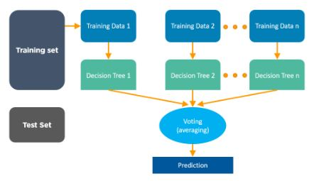
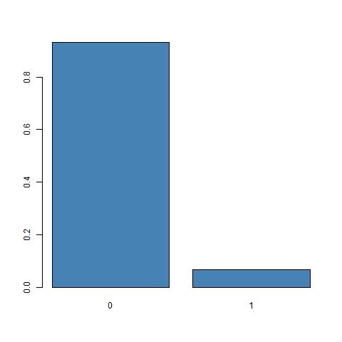
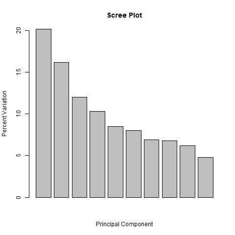
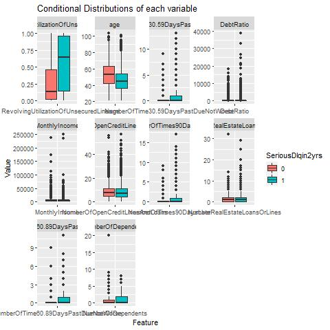
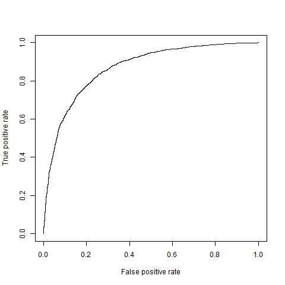
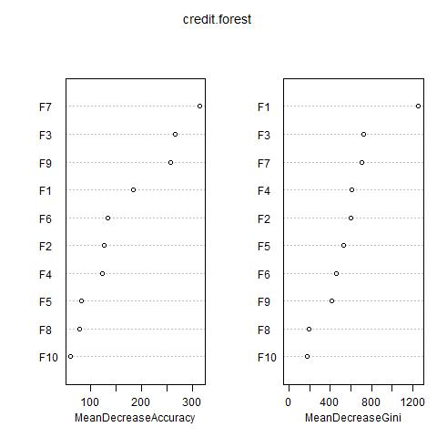
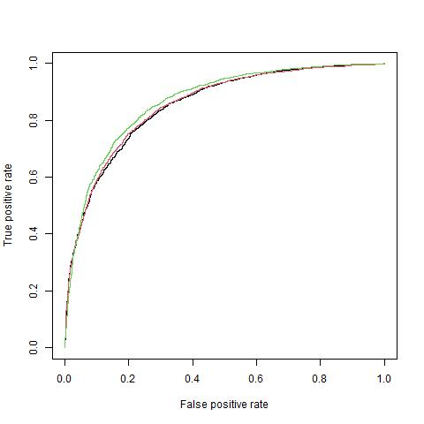

```{r setup, include=FALSE}
knitr::opts_chunk$set(echo = TRUE)
```

\newpage

# [Report]{.smallcaps}

## [1. Introduction/Background]{.smallcaps}

Recent times, financial institutions have been given utmost importance
to credit risk management as it plays immense role in their profit
making. Therefore, more than ever, these instates depends on tools to
aid their decisions such as deciding a person can pay his loan or will
he or she possibly default on his loan. In short, discriminate between
good and bad clients for only accepting the credit applications that are
not likely to default. This probability is commonly denominated as the
probability of default.

Credit scoring models are instruments used to come up with those
probabilities, and they have been gaining popularity over the last
decades. Being an instrument that was first used in the 1960s, it can
briefly be defined as the use of statistical models to transform
relevant data into numerical measures that will guide the credit
decision. These models have evolved in a significant way over the last
years, and in a general overview, they use techniques that allow us to
segment them in two groups according to their statistical approach:
***parametric*** and ***non-parametric***.

Parametric models make assumptions regarding the data they use, such as
normal distribution, linearity, homoscedasticity, and independence. On
the other hand, the non-parametric models make no assumptions.

Logistic regression technique belongs to the first group (parametric
models). Critics exist towards this technique and, they mainly reside in
the assumptions it makes and the violation of those same assumptions
which can sacrifice the model accuracy. As an alternative,
non-parametric models like Random Forest are becoming more popular
aligned with the progress in machine learning which, gives the
"computers the ability to learn without being explicitly programmed".

The **objective of this study** is to classify credit applications as
**"Good"** or **"Bad"** clients using techniques such as **Logistic
Regression** and **Random Forest** and evaluate which technique perform
better with selected Data set.

### [1.1 Credit Dataset]{.smallcaps}

The Kaggle Data set named as "Give Me Some Credit" data set is used for
this study. This data set belongs to the competitions launched by the
Kaggle community, a community of data scientists owned by Google, Inc.

Data set is source from
[Kaggle](https://www.kaggle.com/c/GiveMeSomeCredit/)
[@GiveMeSomeCredit].

As we can observed in exploratory data analysis, the Kaggle data set is
large one, containing 150,000 of records. The list of features given for
each client is described in Table

| [Variable Name]{.smallcaps}           | [Decription]{.smallcaps}                                                                                                                                 | [Type]{.smallcaps} |
|------------------------|------------------------------|------------------|
| ***SeriousDlqin2yrs***                | ***Person experienced 90 days past due delinquency or worse***                                                                                           | ***Y/N***          |
| RevolvingUtilizationOf UnsecuredLines | Total balance on credit cards and personal lines of credit except real estate and no installment debt like car loans divided by the sum of credit limits | percentage         |
| Age                                   | Age of borrower in years                                                                                                                                 | integer            |
| NumberOfTime30-59DaysPastDueNotWorse  | Number of times borrower has been 30-59 days past due but no worse in the last 2 years.                                                                  | integer            |
| DebtRatio                             | Monthly debt payments, alimony,living costs divided by monthy gross income                                                                               | percentage         |
| MonthlyIncome                         | Monthly income                                                                                                                                           | real               |
| NumberOfOpenCreditLines AndLoans      | Number of Open loans (installment like car loan or mortgage) and Lines of credit (e.g. credit cards)                                                     | integer            |
| NumberOfTimes90DaysLate               | Number of times borrower has been 90 days or more past due.                                                                                              | integer            |
| NumberRealEstateLoansOr Lines         | Number of mortgage and real estate loans including home equity lines of credit                                                                           | integer            |
| NumberOfTime60-89DaysPastDueNotWorse  | Number of times borrower has been 60-89 days past due but no worse in the last 2 years.                                                                  | integer            |
| NumberOfDependents                    | Number of dependents in family excluding themselves (spouse, children etc.)                                                                              | integer            |

: Table 1: Feature List

## [2. Algorithms Overview - Methods]{.smallcaps}

### [2.1 Logistic Regression]{.smallcaps}

Logistic regression was developed by the statistician David Cox in 1958,
and it consists of a parametric method that is widely used in the credit
scoring models among financial institutions. The fact that logistic
regression can be used to directly predict probabilities (Brid, 2018) is
one of the main differences comparing to linear regression and it is
quite useful when our dependent variable is categorical. In fact, linear
regression has an output that can fall out of the range 0 to 1, being
for that reason inappropriate for classification problems. Therefore,
logistic regression is better suited for the particular context of
credit scoring, given that we intend to predict the probability of a
certain event to occur. Being more concrete, we want to predict the
probability of a certain client to default (probability of our dependent
variable being 1).


In logistic regression, a link function known as logit, the natural log
of the odds, is used to establish a linear function with the input
variables. In credit scoring context, with this link function that
transforms our outcome variable, logistic regression manages to model a
nonlinear association between the probability of default and the input
variables in a linear way (formula 1). The logit function is also what
enables to scale the independent variables to the scale of a probability
[@mackenzie2017occupancy].

In the same way linear regression uses the method of ordinary least
squares to estimate the coefficients that provide the best fitting,
logistic regression uses a technique called Maximum Likelihood
Estimation that makes a guess for the values of the coefficients and
iteratively changes them in order to maximize the log of the odds
[@anderson2007credit]. In other words, during the fitting process, this
method will estimate the coefficients in such a way it will maximize the
probability of being default of the individuals labelled as default as
well as maximize the probability of not being default of the individuals
labelled as non-default.

In the end, it results in a regression formula with the following form:

Formula 1:
$$ ln(\frac{p(default)}{1 - p(default)}) = \beta_0 + \beta_1X_1 + \beta_2X_2 + ...+ \beta_kX_k + \epsilon $$

where k is the number of independent variables. That can be converted
into a probability:

Formula 2:
$$ p(default|X) = \frac{e^{\beta_0 + \beta_1X_1 + \beta_2X_2 + ...+ \beta_kX_k}}{1 + e^{\beta_0 + \beta_1X_1 + \beta_2X_2 + ...+ \beta_kX_k}} $$

As logistic regression outcomes a probability, a cut-off probability or
threshold needs to be fixed. As an example, if one fixes a threshold of
0.5 the model will classify every sample with a probability of default
above 0.5 as positive (default) and every sample with a probability
below 0.5 as negative (non-default).

In the past, there was a great disadvantage related to this model, which
was its computational intensiveness, but with the progress in computer's
capacities, this problem was overcome. That led to an increase in the
popularity of this technique which is valued for being specifically
designed to handle binary outcomes and for providing a robust estimate
of the actual probability. Although logistic regression is still
regarded as the industry standard technique (Lessmann et al., 2015), it
is not free from several critics in literature that mainly reside in the
assumptions it takes such as linearity between the independent variables
and the log of the odds, or the absence of correlation among the
predictors as well as the relevance of the predictors [@anderson2007credit].
These assumptions are easily violated and naturally compromise the
model's accuracy. The limited complexity associated with this technique
is the main disadvantage in comparison to non-parametric more advanced
machine learning techniques. Still, logistic regression has a strong
advantage compared to other models which is the easy interpretation of
its results. In fact, the coefficients associated to each independent
variable that are estimated during the fitting process reveal, in a very
direct way, the importance of each input variable as it expresses the
size of their effect on the dependent variable.

### [2.2 Random Forest]{.smallcaps}

Random forest is part of the non-parametric models, and it is a method
capable of performing both classification and regression problems, that
uses decision trees as base learners. It was introduced by Breiman in
the early 2000s and became very popular since then. This approach
relates to the concept of bagging, which implies the generation of
different training sets for the various individual learners. In fact,
the model is trained with samples drawn randomly with replacement
(bootstrap samples) from the training data set and using random feature
selection in the process of each single tree generation. Therefore, in
the case of having k trees (base learners), k samples are formed in a
uniform way, collecting, with replacement, Z observations from the
training set. The randomness associated with the way the training occurs
in random forest algorithm contributes to the generated individual trees
to be non-correlated between them.

Although random forests are used both for classification and regression
problems, in the context of credit scoring it is used as an ensemble
classifier. In case of classification, the algorithm chooses the class
with the majority vote (figure 2) while in case of regression it
averages the several outputs of the different models. The underlying
logic is that considering a set of individual learners to form a
prediction gives more accurate results than relying on the prediction of
a single learner. Random forest is seen as one of the most efficient
machine learning algorithms since it is comparably insensitive to skewed
distributions, outliers and missing values. Moreover, the predictive
variables for random forest method can be of any type: numerical,
categorical, continuous or discrete.



### [2.3 AUC - ROC Curve]{.smallcaps}

The Receiver Operator Characteristic (ROC) curve is an evaluation metric
for binary classification problems. It is a probability curve that plots
the TPR against FPR at various threshold values and essentially
separates the 'signal' from the 'noise'. The Area Under the Curve (AUC)
is the measure of the ability of a classifier to distinguish between
classes and is used as a summary of the ROC curve.

The ROC curve is plotted with TPR against the FPR where TPR is on the
y-axis and FPR is on the x-axis.

-   $TP$ (True Positives) = no. of cases correctly identified as
    positive
-   $FP$ (False Positives) = no. of cases incorrectly identified as
    positive
-   $TN$ (True Negatives) = no. of cases correctly identified as
    negative
-   $FN$ (False Negatives) = no. of cases incorrectly identified as
    negative

$$ Accuracy=1-Misclassification \ rate = \frac{TP+TN}{All} $$

$$ TPR/Sensitivity = P(\hat Y=1|Y=1)= \frac{TP}{TP+FN} $$

$$ Specificity  = P(\hat Y=0|Y=0)= \frac{TN}{TN+FP} $$ 

ROC Curve will be used to compare Logistic Regression and Random Forest
outputs.

## [3. Exploratory Data Analysis]{.smallcaps}

### [Missing Values]{.smallcaps}

The table 2 in the supplementary section highlight that MonthlyIncome
and NumberOfDependents have 19.82% and 2.61% of missing values
respectively on Training and Test Data sets.

**MonthlyIncome**

Clients with Monthly income 0 or NA, have been imputed with **Median**
value in the group.

**NumberOfDependents**

Clients with Number of Dependents NA, have been assigned with **"0"** as
it make scene to do so.

### [Data distributions & imputation]{.smallcaps}

**RevolvingUtilizationOfUnsecuredLines**

The *"Revolving Utilization of Unsecured Lines"* is a percentage and
ratio should be between 0 and 1. However there are 3321 records beyond
value 1. Further, as indicated in supplementary section the variable
does not follow normal distribution therefore, it been decided to impute
values beyond 1 is with Median value.

**age**

Age tends have a somewhat reasonable distribution.The only certainly
incorrect data is that there is one person in the data set with age of
0, and because infants are not legally permitted to take out loans, we
will impute that to the next youngest person (age 18) in the data set.

**NumberOfTime30.59DaysPastDueNotWorse**

The analysis of the distribution in the supplementary section for No of
Times defaulted between 30 and 59 days got clients who has more than 95
days defaulted in to past. This data looks incorrect therefore those
records were imputed with "0" value.

**DebtRatio**

Again Debt ration is percentage which represent Monthly debt payments,
alimony, living costs divided by monthly gross income. Debt Ratio more
than 100,000 looks not right. Since we don't have much inside to data
for further verification it was decided to remove those.

**MonthlyIncome**

It was decided to remove clients who got Monthly Income more than 300K.
It assumed that this tool will not be used to evaluate such high profile
clients and having those data in training set may influence outcome of
the prediction.

**NumberOfTimes90DaysLate**

Result are similar to NumberOfTime30.59DaysPastDueNotWorse therefore
imputed with 0 for those with more than 95 days.

### [Imbalanced Data Set]{.smallcaps}

Data set is seriously imbalanced, non-defaulters are 93% and defaulters
are only 7%. This will affect regression methods hence it was decided to
down sampling the defaulters so that they match with record number of
non-defaulters.

```{r, message=FALSE, warning=FALSE, tidy=TRUE, out.height="200px", out.width= "200px", fig.cap="Imbalanced DataSet"}

```

After balancing Feature Visualization

```{r, message=FALSE, warning=FALSE, tidy=TRUE, out.height="200px", out.width= "800px", fig.cap="Principal Component Analysis"}

```

By looking at Principle Components it can be concluded following
features explain 36% of the variance in data

-   RevolvingUtilizationOfUnsecuredLines

-   age

```{r, message=FALSE, warning=FALSE, tidy=TRUE, out.height="300px", out.width= "800px", fig.cap="All the features"}

```

\newpage

## [4. Regression]{.smallcaps}

### [Logistic Regression]{.smallcaps}

As illustrated in supplementary section basic linear function with all
features shows that model is significant with difference of 6284.694 in
deviance and is greater than 18.30 with 0.05 significant. Therefore, we
reject $H_0$.

Basic model using all features predicted client defaulted with AUC value
of 0.844; thus, the model will correctly predict a defaulters 84% of the
time based on given data.

The optimal threshold for model is 0.4814432, which means observations
with predicted probability \< 0.4814432 will be classified as
non-defaulters and observations with predicted probability \> 0.4814432
are as defaulters. The specificity at the optimal threshold is 80% and
sensitivity of 72%.

|       | No   | Yes  |
|-------|------|------|
| **0** | 2205 | 545  |
| **1** | 693  | 1813 |

: Table 2: Confusion Matrix

Misclassification Rate: 23% / Sensitivity: 72% where Specificity: 80%

Further analysis with interaction term, avnova tells us that we need to
use the interaction terms, and the pvalue is very very significant from
the correlation and with intuition some of the interactions that seem
important are as follows:

|                                                                           |        |
|---------------------------------------------------------------|-------|
| RevolvingUtilizationOfUnsecuredLines:NumberOfTime30.59DaysPastDueNotWorse | \*\*\* |
| RevolvingUtilizationOfUnsecuredLines:NumberOfTimes90DaysLate              | \*\*   |
| NumberOfTime30.59DaysPastDueNotWorse:NumberOfTime60.89DaysPastDueNotWorse | \*\*\* |
| NumberOfOpenCreditLinesAndLoans:NumberRealEstateLoansOrLines              | \*\*\* |
| NumberOfTimes90DaysLate:NumberOfTime60.89DaysPastDueNotWorse              | \*\*\* |
| NumberOfOpenCreditLinesAndLoans:NumberRealEstateLoansOrLines              | \*\*\* |
| NumberOfTimes90DaysLate:NumberOfTime60.89DaysPastDueNotWorse              | \*\*\* |
| age:NumberOfDependents                                                    | \*     |

Set-wise Logistic Regression - with interaction performed better than
basic full model

|       | No   | Yes  |
|-------|------|------|
| **0** | 2147 | 603  |
| **1** | 626  | 1880 |

Misclassification Rate: 23% / Sensitivity: 75% where Specificity: 78%

### [Random Forest]{.smallcaps}

By default, randomForest() uses $p/3$ variables when building a random
forest of regression trees, and $\sqrt{p}$ variables when building a
random forest of classification trees.

```{r, message=FALSE, warning=FALSE, tidy=TRUE, out.height="300px", out.width= "300px", fig.cap="ROC Courve"}

```

As above trend highlights Random Forest explain client defaulted with
AUC of 0.8743; therefore the model will correctly predict a defaulters
with 87% accuracy which is much higher than other models.

```{r, message=FALSE, warning=FALSE, tidy=TRUE, out.height="300px", out.width= "300px", fig.cap="Variable Importance"}

```

above highlights the importance of the predictors. Accuracy is estimated
based on Out of Bag Sample data considering variables which have largest
lost in accuracy when data been injected with random numbers. In
contrast, Gini index measured on training sample. Therefore, based on
results we can conclude following predictors/variables play major role.

F7 - NumberOfTimes90DaysLate

F9 - NumberOfTime60.89DaysPastDueNotWorse

F3 - NumberOfTime30.59DaysPastDueNotWorse

F1 - RevolvingUtilizationOfUnsecuredLines

## [5. Conclusion]{.smallcaps}

```{r, message=FALSE, warning=FALSE, tidy=TRUE, out.height="300px", out.width= "300px", fig.cap="ROC For All Regressions"}

```

-   Green - Random Forest

-   Red  - Logistic Regression with Interaction

-   Black  - Logistic Regression - Basic Model

To analyse the model capacity for separating the clients as defaulters and 
non-defaulters which is the classification problems, above figure display 
the ROC curves constructed with three models. The ROC curves plotted for the 
models shoes similarity in terms of the performance. In fact, all models
scored an area under the curve of between 80% to 87% on the test data 
with the best model been Random Forest. 

In conclusion, it is clear that both non-parametric and parametric models 
identified same variables/predictors as importance however, non-parametric 
method (Random Forest) did better job of predicting with marginal gain
with high cost of resources and time to predict. (Refer to supplementary 
section for time taken to process). Therefore, if end goal is interpretation 
of variables, I would select logistic regression with faster results and 
easy explanation. Otherwise, if the goal is prediction alone we can go 
with Random forest. 


\newpage

# [Supplementary material]{.smallcaps}

## [1. Data Loading and Pre-processing]{.smallcaps}

### [Loading packages]{.smallcaps}

```{r, message=FALSE, warning=FALSE, tidy=TRUE}
library(readr)
library(ggplot2)
library(ggpubr)
library(plyr) 
library(dplyr)
library(splitstackshape)
library(Amelia)
library(caret)
library(reshape2)
library(effects)
library(ROCR)
library(pROC)
library(cvAUC)
library(randomForest)
library(doMC)
library(foreach)
```

### [Load the data]{.smallcaps}

```{r, message=FALSE, warning=FALSE, tidy=TRUE}
credit_train_data <- read.csv("./data/cs-training.csv",header = TRUE)
credit_train_data <- as_tibble(credit_train_data)
#head(credit_train_data)
credit_test_data <- read.csv("./data/cs-test.csv",header = TRUE)
credit_test_data <- as_tibble(credit_test_data)
#head(credit_test_data)

```

\textcolor{red}{Drop the index column from data set}

```{r, message=FALSE, warning=FALSE, tidy=TRUE}
credit_train_data <- credit_train_data[,-1]
#head(credit_train_data)
credit_test_data <- credit_test_data[,-1]
#head(credit_test_data)
```

\textcolor{red}{Data Summary}

```{r, message=FALSE, warning=FALSE, tidy=TRUE}
#Train Data Set
str(credit_train_data)
#summary(credit_train_data)
#Test Data Test
#str(credit_test_data)
#summary(credit_test_data)
```

## [2. Missing Values]{.smallcaps}

```{r, message=FALSE, warning=FALSE, tidy=TRUE}
#Analysis of Training Data Set 
columns = c("count")
mis.train.data <- data.frame(sapply(credit_train_data, function(x) sum(is.na(x))))
colnames(mis.train.data) = columns
mis.train.data$ratio <- mis.train.data$count/nrow(credit_train_data) * 100
print("****Table 2: Missing Values - Training Set - Summary ***********")
mis.train.data

#Analysis of Test Data Set 
mis.test.data <- data.frame(sapply(credit_test_data, function(x) sum(is.na(x))))
colnames(mis.test.data) = columns
mis.test.data$ratio <- mis.test.data$count/nrow(credit_test_data) * 100
#mis.test.data
```

MonthlyIncome and Number of Dependents have \~20% and \~2.6% missing
values respectively on both Training and Test Data set

## [3. Data distributions & imputation]{.smallcaps}

**RevolvingUtilizationOfUnsecuredLines**

```{r, message=FALSE, warning=FALSE, tidy=TRUE}
summary(credit_train_data$RevolvingUtilizationOfUnsecuredLines)

#par(mfrow = c(3, 2)) 
layout(matrix(c(1,1,
                2,3,
                4,5), ncol = 3, byrow = TRUE))

hist(credit_train_data$RevolvingUtilizationOfUnsecuredLines,col='steelblue')
boxplot(credit_train_data$RevolvingUtilizationOfUnsecuredLines)

sum(credit_train_data$RevolvingUtilizationOfUnsecuredLines>1)

qqnorm(credit_train_data$RevolvingUtilizationOfUnsecuredLines[
  credit_train_data$RevolvingUtilizationOfUnsecuredLines<=1])
qqline(credit_train_data$RevolvingUtilizationOfUnsecuredLines)


credit_train_data$RevolvingUtilizationOfUnsecuredLines[
  credit_train_data$RevolvingUtilizationOfUnsecuredLines>1]=0.15

ggplot(data = credit_train_data,aes(RevolvingUtilizationOfUnsecuredLines
                                    ))+geom_histogram(col='black',fill='blue')+
  labs(title='Histogram of RevolvingUtilizationOfUnsecuredLines')

boxplot(credit_train_data$RevolvingUtilizationOfUnsecuredLines)
layout(1)

```

**age**

```{r, message=FALSE, warning=FALSE, tidy=TRUE}
ggplot(data = credit_train_data,aes(age))+geom_histogram(col='red',fill='white')+
  labs(title='Histogram of Age')
qqnorm(credit_train_data$age, main = "Age")
qqline(credit_train_data$age)
sum(is.na(credit_train_data$age))
summary(credit_train_data$age)
table(credit_train_data$age<18)
credit_train_data$age[credit_train_data$age<18]=18
```

**NumberOfTime30.59DaysPastDueNotWorse**

```{r, message=FALSE, warning=FALSE, tidy=TRUE}
summary(credit_train_data$NumberOfTime30.59DaysPastDueNotWorse)
par(mfrow = c(1, 2)) 
# distribution 
ggplot(data = credit_train_data,aes(NumberOfTime30.59DaysPastDueNotWorse))+
  geom_histogram(col='black',fill='red')+
  labs(title='Histogram Num of time past 30-59days past')

table(credit_train_data$NumberOfTime30.59DaysPastDueNotWorse)

credit_train_data$NumberOfTime30.59DaysPastDueNotWorse[
  credit_train_data$NumberOfTime30.59DaysPastDueNotWorse>=95]<-0

ggplot(data = credit_train_data,aes(NumberOfTime30.59DaysPastDueNotWorse))+
  geom_histogram(col='black',fill='red')+
  labs(title='Histogram Num of time past 30-59days Past')

```

**DebtRatio**

```{r, message=FALSE, warning=FALSE, tidy=TRUE}
summary(credit_train_data$DebtRatio)
par(mfrow = c(1, 2)) 
boxplot(credit_train_data$DebtRatio)
credit_train_data<-credit_train_data[-which(credit_train_data$DebtRatio>100000),]
summary(credit_train_data$DebtRatio)
boxplot(credit_train_data$DebtRatio)
```

**MonthlyIncome**

```{r, message=FALSE, warning=FALSE, tidy=TRUE}
sum(is.na(credit_train_data$MonthlyIncome))
summary(credit_train_data$MonthlyIncome)
par(mfrow = c(1, 2)) 
#ggplot(data = credit_train_data,aes(MonthlyIncome))+
#  geom_histogram(col='black',fill='red')+
#  labs(title='Histogram of MonthlyIncome')


# do a median imputation for the monthly income
credit_train_data$MonthlyIncome[is.na(credit_train_data$MonthlyIncome)]<-
  median(credit_train_data$MonthlyIncome,na.rm = TRUE)
boxplot(credit_train_data$MonthlyIncome)
summary(credit_train_data$MonthlyIncome)

# remove those got more than 300k monthly income. 
credit_train_data <- credit_train_data[-which(credit_train_data$MonthlyIncome>300000),]

ggplot(data = credit_train_data,aes(MonthlyIncome))+
  geom_histogram(col='black',fill='red')+
  labs(title='Histogram of MonthlyIncome')

#Test data imputation 
credit_test_data$MonthlyIncome <- median(credit_train_data$MonthlyIncome,na.rm = TRUE)

```

**NumberOfOpenCreditLinesAndLoans**

```{r, message=FALSE, warning=FALSE, tidy=TRUE}
summary(credit_train_data$NumberOfOpenCreditLinesAndLoans)

ggplot(data = credit_train_data,aes(NumberOfOpenCreditLinesAndLoans))+
  geom_histogram(col='yellow',fill='green')+
  labs(title='Histogram of num of open credit lines')

boxplot(credit_train_data$NumberOfOpenCreditLinesAndLoans)
```

It appears NumberOfOpenCreditLinesAndLoans - Number of Open loans
(installment like car loan or mortgage) and Lines of credit (e.g. credit
cards) does not need any imputations

**NumberOfTimes90DaysLate**

```{r, message=FALSE, warning=FALSE, tidy=TRUE}
summary(credit_train_data$NumberOfTimes90DaysLate)
par(mfrow = c(1, 2)) 
#ggplot(data = credit_train_data,aes(NumberOfTimes90DaysLate))+
#  geom_histogram(col='yellow',fill='green')+
#  labs(title='Histogram of num of open credit lines')

boxplot(credit_train_data$NumberOfTimes90DaysLate)

table(credit_train_data$NumberOfTimes90DaysLate)

# Similar basis as NumberOfTime30.59DaysPastDueNotWorse setting 0 to people who 
#has gone more than 95 times 

credit_train_data$NumberOfTimes90DaysLate[
  credit_train_data$NumberOfTimes90DaysLate>95]<-0

#ggplot(data = credit_train_data,aes(NumberOfTimes90DaysLate))+
#  geom_histogram(col='yellow',fill='green')+
#  labs(title='Histogram of num of open credit lines')
boxplot(credit_train_data$NumberOfTimes90DaysLate)

```

**NumberRealEstateLoansOrLines**

```{r, message=FALSE, warning=FALSE, tidy=TRUE}
summary(credit_train_data$NumberRealEstateLoansOrLines)
table(credit_train_data$NumberRealEstateLoansOrLines)
credit_train_data <- credit_train_data[
  -(which(credit_train_data$NumberRealEstateLoansOrLines==54)),]

ggplot(data = credit_train_data,aes(NumberRealEstateLoansOrLines))+
  geom_histogram(col='red',fill='blue')+
  labs(title='Histogram of num of real estate loans')
```

**NumberOfTime60.89DaysPastDueNotWors**

```{r, message=FALSE, warning=FALSE, tidy=TRUE}
ggplot(data = credit_train_data,aes(NumberOfTime60.89DaysPastDueNotWorse))+
  geom_histogram(col='red',fill='blue')+
  labs(title='Histogram of num of times 60-89 days')

table(credit_train_data$NumberOfTime60.89DaysPastDueNotWorse)

summary(credit_train_data$NumberOfTime60.89DaysPastDueNotWorse)

# same as before push the absurd values to zero 
credit_train_data$NumberOfTime60.89DaysPastDueNotWorse[
  credit_train_data$NumberOfTime60.89DaysPastDueNotWorse > 95] <- 0

ggplot(data = credit_train_data,aes(NumberOfTime60.89DaysPastDueNotWorse))+
  geom_histogram(col='red',fill='blue')+
  labs(title='Histogram of num of times 60-89 days')
```

**NumberOfDependents**

```{r, message=FALSE, warning=FALSE, tidy=TRUE}
sum(is.na(credit_train_data$NumberOfDependents))
summary(credit_train_data$NumberOfDependents)

# It assumed that No of Dependents NA is equal to NO dependents   
credit_train_data$NumberOfDependents[is.na(credit_train_data$NumberOfDependents)] <- 0

# Test data Imputation
credit_test_data$NumberOfDependents[is.na(credit_test_data$NumberOfDependents)] <- 0

```

## [4. Imbalanced Data Set]{.smallcaps}

```{r, message=FALSE, warning=FALSE, tidy=TRUE}
prop.table(table(credit_train_data$SeriousDlqin2yrs))
jpeg(file="figures/ImbalancedDataSet.jpeg")
barplot(prop.table(table(credit_train_data$SeriousDlqin2yrs)),col = 'steelblue')
dev.off()

# serious data imbalance
# addressing the data imbalance by downsampling the 0 class in serious
# dlwin2yrs 

sum(credit_train_data$SeriousDlqin2yrs == 1)
new_credit_train_data <- credit_train_data[credit_train_data$SeriousDlqin2yrs == 1,]
DownsampleDat <- credit_train_data[credit_train_data$SeriousDlqin2yrs == 0,]

#No of records with 0 are 139,938 therefore selecting 11000 out of that  
downsam <-sample(1:139938,11000)

newDat <- rbind(new_credit_train_data,DownsampleDat[downsam,])
newDat <- newDat[sample(nrow(newDat)),]
rownames(newDat) <- NULL

newDat$SeriousDlqin2yrs <- as.factor(newDat$SeriousDlqin2yrs)

set.seed(10)
train_Index <- createDataPartition(newDat$SeriousDlqin2yrs, p = .75, 
                                   list = FALSE, 
                                   times = 1)
new_train_data <- newDat[train_Index,]
new_test_data <-  newDat[-train_Index,]


```

## [5. Data Visualization]{.smallcaps}

```{r, message=FALSE, warning=FALSE, tidy=TRUE}
# melting the data frame
jpeg(file="figures/DataVisualization1.jpeg")
feature.names<-names(newDat)[-1]

vizDat<- melt(newDat,id.vars = 'SeriousDlqin2yrs'
              ,measure.vars = feature.names, variable.name = "Feature"
              ,value.name = "Value")

# conditional box plots for each feature on the response variable
p <- ggplot(data = vizDat, aes(x=Feature, y=Value)) + 
             geom_boxplot(aes(fill=SeriousDlqin2yrs))
p <- p + facet_wrap( ~ Feature, scales="free")
p + ggtitle("Conditional Distributions of each variable")

dev.off()

jpeg(file="figures/DataVisualization2.jpeg")
newDat.s<- scale(newDat[,-1],center=TRUE, scale=TRUE)
Dat.pc<-prcomp(newDat.s)
summary(Dat.pc)
plot(Dat.pc$x[,1:2],col=newDat$SeriousDlqin2yrs)

dev.off()
#No clear distribution 

jpeg(file="figures/DataVisualization3.jpeg")
Dat.pc.var <- Dat.pc$sdev^2
Dat.pc.var.per <- round(Dat.pc.var/sum(Dat.pc.var)*100,1)
barplot(Dat.pc.var.per,main = "Scree Plot", xlab = "Principal Component", 
        ylab ="Percent Variation")

dev.off()
```

## [6. Logistic Regression]{.smallcaps}

```{r, message=FALSE, warning=FALSE, tidy=TRUE}

logical.model_1 <- glm(SeriousDlqin2yrs~.,data = new_train_data,
                       family = binomial)
summary(logical.model_1)

dev <- logical.model_1$null.deviance - logical.model_1$deviance
deg_fre <- logical.model_1$df.null - logical.model_1$df.residual
dev
qchisq(0.95, df = deg_fre)

#plot(allEffects(logical.model_1))


```

Since difference (6131.325) in deviance is greater than 18.30 with 0.05
significant, we reject $H_0$, the model is significant.

### [ROC and AUROC]{.smallcaps}

```{r, message=FALSE, warning=FALSE, tidy=TRUE}

pred.logical.model_1 <- predict(logical.model_1,new_test_data[,-1],
                                type='response')
pr <- prediction(pred.logical.model_1, new_test_data$SeriousDlqin2yrs)
prf0 <- performance(pr, measure = "tpr", x.measure = "fpr")
#plot(prf0, col=rainbow(10))

df <- tibble(pred_prob = pred.logical.model_1,
             Actual = new_test_data$SeriousDlqin2yrs)

pROC_graph <- roc(df$Actual,
                  df$pred_prob,
                  smoothed = TRUE,
                  ci=TRUE, 
                  ci.alpha=0.9,
                  stratified=FALSE,
                  plot=TRUE, 
                  auc.polygon=TRUE,
                  max.auc.polygon=TRUE,
                  grid=TRUE,
                  print.auc=TRUE,
                  show.thres=TRUE)
sens.ci <- ci.se(pROC_graph)
plot(sens.ci, type="shape", col="lightblue")   
plot(sens.ci, type="bars")

## optimal cutoff
coords(pROC_graph, "best")

```

Basic model using all features predicted client defaulted with AUC value
of 0.849; thus, the model will correctly predict a defaulters 84% of the
time based on given data.

The optimal threshold for model is 0.4814432, which means observations
with predicted probability \< 0.4814432 will be classified as
non-defaulters and observations with predicted probability \> 0.4814432
are as defaulters. The specificity at the optimal threshold is 80% and
sensitivity of 72%.

```{r, message=FALSE, warning=FALSE}
cutoff <- 0.4814432
df <- dplyr::mutate(
  df, 
  Class_predicted = ifelse(pred_prob > cutoff, "Yes", "No")
  )
tab <- table(df$Actual, df$Class_predicted)
tab
# misclassification rate
1- sum(diag(tab))/sum(tab)
# sensitivity - % correctly predicting as default
tab[2,2]/sum(tab[2,])
# specificity - % correctly predicting as not default
tab[1,1]/sum(tab[1,])

```

With cutpff 0.4814432, misclassification is 23%

### [Full two interaction model]{.smallcaps}

```{r, message=FALSE, warning=FALSE, results='hide'}

inter.logical.model_2 <- glm(SeriousDlqin2yrs~(.)^2,data = new_train_data,
                             family = binomial)
summary(inter.logical.model_2)


```

```{r, message=FALSE, warning=FALSE}
anova(logical.model_1,inter.logical.model_2,test = 'Chisq')
```

### [step-wise selection]{.smallcaps}

```{r, message=FALSE, warning=FALSE, results='hide'}

step.logical <- step (inter.logical.model_2, trace = 0)
summary(step.logical)


```

```{r, message=FALSE, warning=FALSE}
anova(step.logical,inter.logical.model_2,test = 'Chisq')
```

that's a lot of interactions selected by the step regression and step
selected model is better than the complete interaction model.

### [ROC and AUROC FOR THE STEP-WISE MODEL]{.smallcaps}

```{r, message=FALSE, warning=FALSE}
pred.logi.model_step <- predict(step.logical,new_test_data[,-1],type='response')
out <- cvAUC(pred.logi.model_step,new_test_data$SeriousDlqin2yrs)

par(mfrow = c(2, 2)) 

plot(out$perf)
out$cvAUC
pr <- prediction(pred.logi.model_step, new_test_data$SeriousDlqin2yrs)
prf1 <- performance(pr, measure = "tpr", x.measure = "fpr")

plot(prf1, col=rainbow(10))

df <- tibble(pred_prob = pred.logi.model_step,
             Actual = new_test_data$SeriousDlqin2yrs)

pROC_graph <- roc(df$Actual,
                  df$pred_prob,
                  smoothed = TRUE,
                  ci=TRUE, 
                  ci.alpha=0.9,
                  stratified=FALSE,
                  plot=TRUE, 
                  auc.polygon=TRUE,
                  max.auc.polygon=TRUE,
                  grid=TRUE,
                  print.auc=TRUE,
                  show.thres=TRUE)
sens.ci <- ci.se(pROC_graph)
plot(sens.ci, type="shape", col="lightblue")   
plot(sens.ci, type="bars")

## optimal cutoff
coords(pROC_graph, "best")


cutoff <- 0.4860458	
df <- dplyr::mutate(
  df, 
  Class_predicted = ifelse(pred_prob > cutoff, "Yes", "No")
  )
tab <- table(df$Actual, df$Class_predicted)
tab
# misclassification rate
1- sum(diag(tab))/sum(tab)
# sensitivity - % correctly predicting as default
tab[2,2]/sum(tab[2,])
# specificity - % correctly predicting as not default
tab[1,1]/sum(tab[1,])

```

## [7. Random Forest]{.smallcaps}

```{r, message=FALSE, warning=FALSE}
names(new_train_data) <- c('SeriousDlqin2yrs','F1','F2','F3','F4','F5'
                           ,'F6','F7','F8','F9','F10')
names(new_test_data)  <- c('SeriousDlqin2yrs','F1','F2','F3','F4','F5'
                  ,        'F6','F7','F8','F9','F10')

a <- proc.time()
set.seed(100)
credit.forest<-randomForest(SeriousDlqin2yrs~.,
                            data = new_train_data,mtry=2,
                            importance=TRUE,
                            ntree=5000)

proc.time() - a
jpeg(file="figures/VariableImportancePlotRF.jpeg")
varImpPlot(credit.forest)
dev.off()

pred.forest <- predict(credit.forest,newdata = new_test_data[,-1],'prob')

output<-pred.forest[,2]

pr <- prediction(output, new_test_data$SeriousDlqin2yrs)

prf2 <- performance(pr, measure = "tpr", x.measure = "fpr")

jpeg(file="figures/TrueFalsePositiveRate.jpeg")
plot(prf2)
dev.off()

auc <- performance(pr, measure = "auc")

auc <- auc@y.values[[1]]

auc

# trying to parallelize the forest 


registerDoMC(2)
b <-proc.time()
set.seed(100)
credit.forestpar<-foreach(ntree=rep(1250, 4)
                       ,.combine=combine
                       ,.multicombine = TRUE
                       ,.packages='randomForest') %dopar% 
       randomForest(SeriousDlqin2yrs~.
      ,data = new_train_data
      ,mtry=3
      ,importance=TRUE
      ,ntree=ntree)

proc.time()-b


```

## [8. ROC curves of all models]{.smallcaps}

```{r}
# ROC curves of all models
jpeg(file="figures/ROCcurves4All.jpeg")
plot( prf0) #black
plot(prf1, add = TRUE,col=2 ) #red
plot(prf2, add = TRUE, col=3) #green
dev.off()
```

\newpage

# [Refence]{.smallcaps}
